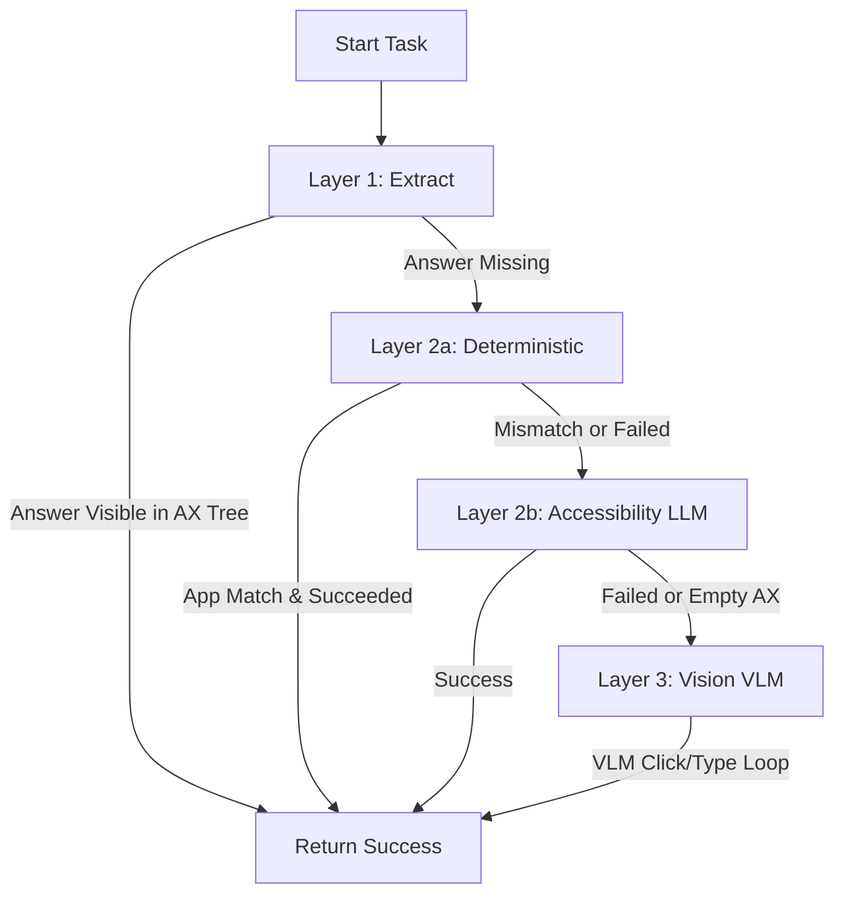

# Computer-Use Agent with 4-Layer Cascade Architecture (Session 10)

This repository implements an autonomous **Computer-Use Agent** built on top of the `cua-driver` substrate. It uses a **4-Layer Cascade Architecture** that balances speed, cost, and intelligence when automating desktop applications (Calculator, Gedit, Obsidian) on Linux.

All LLM and vision calls are executed through the self-hosted **V9 Gateway** (Gemini client), utilizing zero paid APIs or third-party agentic frameworks.

---

## 1. 4-Layer Cascade Architecture

The agent executes actions through a cascading hierarchy of layers, starting with the fastest/cheapest and escalating to smarter/multimodal fallback paths when needed.



### The 4 Layers Explained
1. **Layer 1: Extract (Direct Read):** Reads the OS accessibility (AX) tree text directly. If the target answer or state is already visible on screen, it returns success immediately (0 cost, <0.1s execution).
2. **Layer 2a: Deterministic (Hardcoded Automation):** Executes native hotkeys, AX tree index clicks, and shell commands for known apps (e.g. Gnome Calculator, Gedit, Obsidian). This provides rapid, 100% reliable execution for standard workflows.
3. **Layer 2b: Accessibility (LLM + AX Tree):** Uses a text-only Gemini LLM to reason about the AX tree markdown representation and emit structured actions (click element index, type text, or mark as done).
4. **Layer 3: Vision (VLM + Screenshots):** Captures screenshots of the application window, sends them to a multimodal Gemini VLM, maps click coordinates, and performs physical mouse clicks/keystrokes using `cua-driver`.

---

## 2. Completed Tasks & Assignment Requirements

We have implemented and successfully executed all required task options and satisfied the assignment's strict constraints.

### Task Matrix & Evidence

| Task / Constraint | App Target(s) | Execution Path | Session ID | Trajectory Evidence / Outcome |
| :--- | :--- | :--- | :--- | :--- |
| **Task 1: Calculator Arithmetic** | Gnome Calculator | Layer 2a (Deterministic) | `s8-a82f43bf` | **Zero Vision Calls.** Clicked AX buttons directly to perform multiplication: `145 * 123 = 17835`. |
| **Task 2: Gedit File Writing** | Gedit | Layer 2a (Deterministic) / Layer 2b | `s8-dbf256f7` | Created file, wrote result, navigated GTK save dialog to save to `/home/mani_radhakrishnan/sandbox_session10`. |
| **Task 3: Electron CDP Integration** | Obsidian | Layer 2a (Page Tool CDP) | `s8-dbf256f7` | **Electron Page Path.** Connected to debugging port 9223 and executed JavaScript to write note content. |
| **Task 4: Visual Sliding Puzzle** | Chrome (Sliding Puzzle) | Layer 3 (Vision VLM) | `s8-9053ac66` | **Vision Path.** Identified displaced Tile 6 and clicked it to restore order, verifying Solved status in 2 turns. |
| **Multi-App Workflow** | Calculator ➔ Gedit ➔ Obsidian | Layer 2a / Page / 2b | `s8-dbf256f7` | Orchestrated pipeline: calculated 4*8 = 32, saved to Gedit, and created Obsidian note. |

---

## 3. Technical Implementation Details

### A. Electron Page Path Integration (Obsidian)
Electron applications (like Obsidian, VS Code, Notion) present a sparse accessibility tree (Mac/Linux sees the window as a single opaque `AXWebArea`). 
To solve this:
1. **Launch with Debug Port:** Obsidian is launched with `--remote-debugging-port=9222`.
2. **Reload CUA Daemon:** The agent automatically exports `CUA_DRIVER_CDP_PORT=9222` and restarts the `cua-driver serve` daemon to enable CDP WebSocket connection.
3. **Execute Javascript:** The agent invokes `cua-driver`'s **`page`** tool with the `"execute_javascript"` action to evaluate code directly in the Chromium DOM:
   ```javascript
   (async () => {
     let title = "note.md";
     let file = app.vault.getAbstractFileByPath(title);
     if (file) {
       await app.vault.modify(file, "Content");
     } else {
       await app.vault.create(title, "Content");
     }
     return "OK";
   })()
   ```

### B. Vision Escalation (Forced Layer 3)
For targets with no ARIA tree structure (e.g. canvas rendering or canvas games), the agent escalates to Layer 3. The orchestrator:
1. Captures a screenshot of the window using `cua-driver`.
2. Prompts the multimodal VVL with the screenshot and a goal.
3. Receives coordinate-based click actions (e.g., `click(x, y)`) and translates them into physical mouse clicks.

---

## 4. Failure Modes & Resolutions

### 1. GTK Save-As Modal Dialog Challenge
* **Problem:** In Gedit, when the Save-As dialog is triggered, the window hierarchy changes. The primary Gedit window ID no longer responds, and synthetic X11 key events (like `Ctrl+L` for Location Bar navigation) are silently ignored by GTK for security.
* **Resolution:** 
  1. We modified the save workflow to combine **Layer 2a (deterministic)** for typing text and opening the dialog, and **Layer 2b (accessibility LLM)** to complete the save.
  2. Instead of simulating X11 keyboard events, we mapped `type_text` to AT-SPI's `set_value` action, letting the LLM enter the **FULL PATH** (e.g. `/home/mani_radhakrishnan/sandbox_session10/mr_s10_05.txt`) directly into the filename field.
  3. This bypasses keyboard simulation entirely and successfully commits the path.

### 2. File Name Collisions and Confirmation Dialogs
* **Problem:** If a file with the same name already exists on disk, GTK shows a "Replace" confirmation popup, and Obsidian creates duplicate files (e.g. `note 1.md`). This blocked/stalled the automation.
* **Resolution:** 
  1. We added pre-deletion logic to both Gedit and Obsidian save paths: before saving, the agent deletes the target file if it exists. This prevents the confirmation dialog from popping up entirely.
  2. We updated the `A11Y_SYSTEM` prompt instructions so that if a confirmation dialog does appear, the LLM will find and click the "Replace" button.

### 3. Agent Cursor Visibility and Glide Lag
* **Problem:** The visual agent-cursor overlay lagged behind numerical inputs in the calculator, and sometimes disappeared if not explicitly registered.
* **Resolution:**
  1. We mapped a global active session variable (`_ACTIVE_SESSION`) in `computer/skill.py` that automatically appends the session ID to all `cua-driver` action calls.
  2. We configured the cursor motion with `glide_duration_ms: 0` at session start. This forces the visual cursor to jump instantly to target coordinates, syncing it perfectly with inputs.

---

## 5. Setup & Execution Guide

If you are running this codebase for the first time, follow these steps to set up and run the agent successfully:

### 1. Pre-requisites
* **Operating System**: Linux (X11 desktop environment).
* **Required Apps**: Gnome Calculator, Gedit, Obsidian, Google Chrome.
* **cua-driver**: Ensure the low-level `cua-driver` substrate binary is installed and running in the background:
  ```bash
  cua-driver serve
  ```

### 2. Dependency Setup
Initialize the local virtual environment and install dependencies:
```bash
cd S9SharedCode/code
uv sync
```

### 3. Environment Configuration
Create a `.env` file inside `S9SharedCode/code/` containing your API keys and local configuration details (see `.env.example` as a template):
```text
GEMINI_API_KEY=your_gemini_api_key
```

### 4. Running the Local Gateway Proxy
The agent routes LLM and vision calls through a local **V9 Gateway** server:
```bash
cd llm_gatewayV9
uv run python gateway_server.py
```

### 5. Running the Agent (CLI Queries)
Navigate to the application code directory and execute the agent workflow using `flow.py`:
```bash
cd S9SharedCode/code

# Gnome Calculator Arithmetic
uv run flow.py "calculate 145*123 using calculator app"

# Visual Sliding Puzzle
uv run flow.py "Using vision, click the out-of-order tile on the sliding puzzle grid to solve it, and verify that the status says Solved"

# Multi-App Workflow (Calculator ➔ Gedit ➔ Obsidian)
uv run flow.py "Calculate 4 times 8 using calculator app, save it to a gedit file at /home/mani_radhakrishnan/sandbox_session10/mr_s10_workflow.txt, and create an Obsidian note with the result in the name mr_workfow"
```

### 6. Starting the Dashboard Web UI
To run and monitor the agent interactively through the browser:
```bash
cd S9SharedCode/code
uv run python dashboard.py
```
Open **`http://localhost:8110`** in your browser to run tasks, select presets, view the real-time execution DAG, and inspect logs.

---

## 6. Terminal Run Query Logs

Below are the terminal command logs for the successful executions:

### A. Task 1: Pure Calculator Arithmetic
```bash
uv run flow.py "calculate 145*123 using calculator app"
```
**Output Logs:**
```text
session s8-a82f43bf  ─  query: calculate 145*123 using calculator app
[n:1] planner            complete (0.6s)
[ComputerSkill] app=Calculator pid=42363 wid=109051911 goal=calculate 145*123
[ComputerSkill] AX tree: 355 elements
[ComputerSkill] Layer 2a (deterministic): expression = 145*123
[ComputerSkill] Layer 2a: clicked '1' (element_index=177)
[ComputerSkill] Layer 2a: clicked '4' (element_index=184)
[ComputerSkill] Layer 2a: clicked '5' (element_index=180)
[ComputerSkill] Layer 2a: clicked '×' (element_index=171)
[ComputerSkill] Layer 2a: clicked '1' (element_index=177)
[ComputerSkill] Layer 2a: clicked '2' (element_index=176)
[ComputerSkill] Layer 2a: clicked '3' (element_index=172)
[ComputerSkill] Layer 2a result: 145*123 = 17835
[n:2] computer           complete (34.3s)

FINAL: {"app": "Calculator", "goal": "calculate 145*123", "path": "deterministic", "turns": 8, "content": "145*123 = 17835"}
```

### B. Multi-App Workflow (Calculator ➔ Gedit ➔ Obsidian)
```bash
uv run flow.py "Calculate 4 times 8 using calculator app, save it to a gedit file at /home/mani_radhakrishnan/sandbox_session10/mr_s10_workflow.txt, and create an Obsidian note with the result in the name mr_workfow"
```
**Output Logs:**
```text
session s8-dbf256f7  ─  query: Calculate 4 times 8 using calculator app  , save it to a gedit file at /home/mani_radhakrishnan/sandbox_session10/mr_s10_workflow.txt, and create an Obsidian note with the result in the name mr_workfow
[n:1] planner            complete (0.9s)
[ComputerSkill] app=Calculator pid=27525 wid=90177543 goal=calculate 4 times 8
[ComputerSkill] AX tree: 355 elements
[ComputerSkill] Layer 2a (deterministic): expression = 4*8
[ComputerSkill] Layer 2a: clicked '4' (element_index=184)
[ComputerSkill] Layer 2a: clicked '×' (element_index=171)
[ComputerSkill] Layer 2a: clicked '8' (element_index=182)
[ComputerSkill] Layer 2a result: 4*8 = 32
[n:2] computer           complete (20.7s)
[ComputerSkill] Restarting cua-driver daemon to apply CUA_DRIVER_CDP_PORT...
[ComputerSkill] app=gedit pid=27797 wid=75497720 goal=save result to /home/mani_radhakrishnan/sandbox_session10/mr_s10_workflow.txt
[ComputerSkill] app=Obsidian pid=27819 wid=77594628 goal=create note with result in name mr_workfow
[ComputerSkill] AX tree: 241 elements
[ComputerSkill] Layer 2a (gedit): dir=/home/mani_radhakrishnan/sandbox_session10, file=mr_s10_workflow.txt, content=The calculated result is 32.
[ComputerSkill] Layer 2a (gedit): Save As dialog found (wid=75499459). Completing save deterministically via Ctrl+L.
[ComputerSkill] Layer 2a (gedit): Sending Ctrl+L to show location entry
[ComputerSkill] Layer 2a (gedit): Typing path '/home/mani_radhakrishnan/sandbox_session10/mr_s10_workflow.txt' via cua-driver
[ComputerSkill] Layer 2b (a11y): starting LLM-guided loop
[ComputerSkill] Layer 2b turn 1: set_value succeeded for idx=243 with '/home/mani_radhakrishnan/sandbox_session10/mr_s10_workflow.txt'
[ComputerSkill] Layer 2b turn 2: clicked idx=242
[ComputerSkill] AX tree: 1 elements
[ComputerSkill] Layer 2a (obsidian): dir=/home/mani_radhakrishnan/Obsidian Vault, title=mr_workfow, content=The calculated result is 32.
[ComputerSkill] Attempting Obsidian save via CDP page tool...
[ComputerSkill] CDP page tool SUCCESS: Saved to /home/mani_radhakrishnan/Obsidian Vault/mr_workfow.md
[ComputerSkill] Layer 2b done
[n:3] computer           complete (91.2s)
[n:4] computer           complete (79.5s)
[n:5] formatter          complete (4.5s)

FINAL: The calculation of 4 times 8 is 32. This result has been saved in a gedit file located at /home/mani_radhakrishnan/sandbox_session10/mr_s10_workflow.txt. Additionally, an Obsidian note named 'mr_workfow' has been created containing the result 32.
```

### C. Task 4: Visual Sliding Puzzle
```bash
uv run flow.py "Using vision, click the out-of-order tile on the sliding puzzle grid to solve it, and verify that the status says Solved"
```
**Output Logs:**
```text
session s8-9053ac66  ─  query: Using vision, click the out-of-order tile on the sliding puzzle grid to solve it, and verify that the status says Solved
[n:1] planner            complete (1.1s)
[ComputerSkill] app=sliding puzzle pid=35581 wid=88080397 goal=click the out-of-order tile to solve the puzzle and verify the status says Solved
[ComputerSkill] AX tree: 1 elements
[ComputerSkill] Layer 3 (vision): starting screenshot loop
[ComputerSkill] Layer 3 VLM Thinking: The puzzle shows tile 6 is in the wrong position (bottom-right corner, where the empty space should be). The empty space is currently in the middle-right position. To solve the puzzle, I need to click on tile 6 to move it into the empty space. Tile 6 is located at approximately x=343, y=623.
[ComputerSkill] Layer 3 turn 1: fullscreen click (343,623) -> pixel (658,672) -> screen (658,672)
[ComputerSkill] Layer 3: click delivered via X11 Xlib at screen (658, 672)
[ComputerSkill] Layer 3 VLM Thinking: The puzzle status is already 'Solved'. I have verified the goal is complete.
[n:2] computer           complete (22.4s)

FINAL: {"app": "sliding puzzle", "goal": "click the out-of-order tile to solve the puzzle and verify the status says Solved", "path": "vision", "turns": 2, "content": ""}
```

---

## 7. Repository File Directory Structure & Gitignore

Below is a detailed inventory of files in the workspace, classifying their role and version-control status:

| File / Folder | Role | Status / Action | Description |
| :--- | :--- | :--- | :--- |
| `S9SharedCode/code/` | **Core Application** | **Active (Tracked)** | Contains the computer-use agent (`flow.py`, `skills.py`), dashboard UI (`dashboard.py`, `static/`), prompts (`prompts/`), and tests (`tests/`). |
| `llm_gatewayV9/` | **Client Routing Gateway** | **Active (Tracked)** | Local server that routes LLM/vision API requests to Gemini Client V9 without external paid wrappers. |
| `CUA_DRIVER_GUIDE.md` | **Documentation** | **Tracked** | Complete reference manual for the low-level `cua-driver` substrate API. |
| `README.md` | **Documentation** | **Tracked** | Main repository documentation, architecture overview, task matrix, and logs. |
| `queries.md` | **Documentation** | **Tracked** | CLI command references for running specific tasks/tests. |
| `Session_Summary.md` | **Reference Guide** | **Tracked** | Original session lectures explaining accessibility APIs, Wayland portals, and the cascade layer architecture. |
| `assignment.md` | **Reference Guide** | **Tracked** | Assignment rules, tasks, and constraints description. |
| `letsdothis.md` | **Reference Notes** | **Ignored** | User's initial bug reports and verification checklists. |
| **`.gitignore`** | **Git Exclusion Rules** | **Tracked** | Excludes cache, dependencies, and dynamically generated profile folders. |
| **`learn/`** | **Developer Learning & Scratch** | **Ignored** | Ignored globally. Contains early prototyping validation scripts (`step1` to `step4`), images, and the cloned `cua-driver` repository. |
| **`.env`** | **Environment Secrets** | **Ignored** | Local API keys, routing addresses. Excluded from version control for security. |
| `S9SharedCode/code/.venv/` | **Virtual Environment** | **Ignored** | Local Python dependencies. Excluded to keep the repo lightweight. |
| `sandbox_chrome_profile*/` | **Browser Cache** | **Ignored** | Temporary Chrome profile folders generated dynamically during browser/canvas task execution. |
| `S9SharedCode/code/state/` | **Execution State** | **Ignored** | Local SQLite databases, session history, execution graphs, and screenshot captures. |
| `*state*.json` / `*vision*.json` | **Debug Dumps** | **Ignored** | Temporary dumps of Gnome/GTK accessibility trees or VLM vision prompts. |
| `query_run_01.txt` | **Run Log Dumps** | **Ignored** | Terminal output records copied from execution runs. |


## WORKING VIDEO
Please check the agent working video here
https://youtu.be/2kc250QLVb0